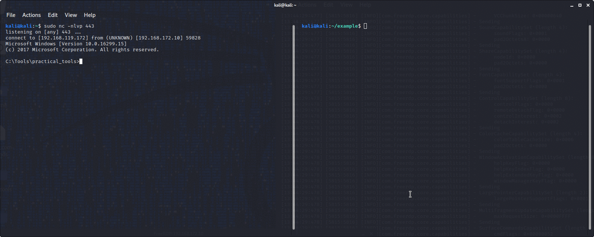

# turtlepower
Turtlepower is a collection of scripts I use to make boring repetive tasks I do in pentesting happen quick and easy so I can focus my energy on pwning.

When doing the OSCP I realised some other students may be interested in this so I put it on github.

How turtlepower works, is you download the scripts then put them in your .bashrc.

Simple, repetive tasks we do in pentesting like setting up webserver and downloading a file to the box we are attacking, or setting up a reverse shell are then reduced to a few keystrokes.

I have also made the scripts easy to adapt to add file transfer methods or shells you wish to add.

DISCLAIMER:
I made these scripts for me, the code is hacky. It doesn't really need to be that optimised does it though, not a whole lot of computing power going on here.
Get in touch if you want to refine it as long as you give me credit.

# turtlepower scripts

## turtlepower_lhost
We use this first just to echo out into our terminal the command to set out lhost for the rest of the scripts. Even though some people may moan about having to copy and paste one thing in, I thought it was a bad idea to hardcode this into the scripts meaning you can easily work across different interfaces and servers and you won't accidentally pwn things you are not meant to pwn.

If you want to live dangerously and hardcode a lhost for your session, just put a line in your .bashrc like this 
export turtlepower_lhost=192.168.1.101


Usage: 
```
$ turtlepower_lhost
```
## turtlepower_server_pyserver

Sets up a python http server on port 80, then lets you choose a file transfer method, for example powershell, certutil or wget, then prints in the terminal the command to download the files in the directory you launched it from in your file transfer method of choice. 

You are meant to copy and paste the command into a command prompt on the box you are attacking. Saves a lot of time transferring files

Usage:
```
$ turtlepower_server_pyserver
```
You can also use this if you just want to print the transfer methods and not spin up an HTTP server:
```
$ turtlepower_server_pyserver_ls
```
## turtlepower_server_smbserver


Like python server, but spins up a SMB server with Impacket and lists the commands to download or execute in memory the files in your working directory over SMB. 
Usage:
```
$ turtlepower_server_smbserver
```
## turtlepower_reverse_shell

You choose the sort of reverse shell you want, for example, powershell, socat, netcat, python, you choose the LPORT and it will echo the command in your terminal to paste into the box you are attacking. 

It will also set up a netcat listener to catch it as well if you want.

Usage:
```
$ turtlepower_reverse_shell
```

# Setup
Make a scripts folder in your kali home directory and put turtlepower in

```
mkdir /home/kali/scripts
cd /home/kali/scripts
git clone https://github.com/kintsugi-sec/turtlepower
cd turtlepower
chmod a+x *
```


Add the following lines to your .bashrc
```
## Turtlepower ## 

# shows us the IP of tun0 and sets it to $lhost_ip
alias turtlepower_lhost='/home/kali/scripts/turtlepower/./turtlepower_lhost.sh'

# server setup scripts
alias turtlepower_server_pyserver='/home/kali/scripts/turtlepower/./turtlepower_pyserver.sh'
alias turtlepower_server_pyserver_ls='/home/kali/scripts/turtlepower/./turtlepower_pyserver_ls.sh'

# reverse shell scripts
alias turtlepower_reverse_shell='/home/kali/scripts/turtlepower/./turtlepower_reverse_shell.sh'
```

Save, close and reload your .bashrc

```
source .bashrc
```
